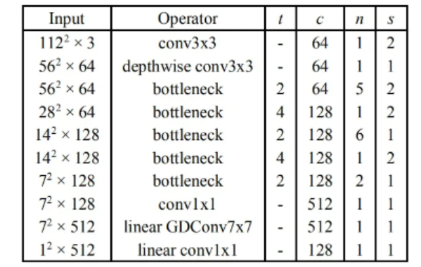

# Readme

### 

### 简要描述

**数据增强**

由于对图片没有任何假设，例如图像没有对齐，所以要对图片进行预处理。

改变对比度饱和度：T.ColorJitter()

随机旋转: T.RandomHorizontalFlip()

水平翻转: T.RandomVerticalFlip()

**训练网络**

**MobileFaceNet**:

由于此任务的类别比较多，且任务目标与人脸识别接近，均为图像处理任务。所以选取人脸识别中的轻量化模型MobileFaceNet[1]



**损失计算**

损失计算: areface

areface损失函数是人脸识别的常用损失

$ L_{Arcface} = \frac{1}{N} \sum_{i=1}^{N}log\frac{e^{s(cos(\theta _{yi}+m))}}{e^{s(cos(\theta _{yi}+m))+ {\textstyle \sum_{j=1,j\neq yi}^{n}e^{scos\theta_{j}}} }} $  

### **运行步骤**
将数据集文件`efficient_fashion_matching`放在项目的一级目录下
```bash
# train model
python run.py --cuda=True --device_ids=0,1 --batch_size=128 --arcface=True
# test best model
python run.py --load_epoch=best --match_factor=3 --cuda=True --device_ids=0,1 --batch_size=128
```

### **测试方式**

验证集：划分了400个类给验证集

测试集：所给的测试集

训练集：所给的训练集减去验证集的数据

用训练集训练模型，用验证集验证模型，用测试集评估模型

匹配机制：设置了match_factor参数，取 测试/验证图片数量*match_factor 作为匹配数量，取对应数量的匹配数量和不匹配数量，让匹配数量照片和不匹配数量照片保持相等，比例各占1/2。

评估指标：计算EER。该值表明错误接受的比例等于错误拒绝的比例。等错误率值越低，识别系统的准确度越高

### **测试结果**

```bash
INFO:utils:FasionMatching-v1
INFO:utils:Model Testing...
INFO:utils:Select Match Samples for test...
INFO:utils:EER: 0.88%	Thresh: 0.304
```

最终模型在测试集上的等错误率(EER)为0.88%

### **参考资料**

[1] Chen S, Liu Y, Gao X, et al. Mobilefacenets: Efficient cnns for accurate real-time face verification on mobile devices[C]//Chinese Conference on Biometric Recognition. Springer, Cham, 2018: 428-438.

[2] [https://github.com/Xiaoccer/MobileFaceNet_Pytorch](https://github.com/Xiaoccer/MobileFaceNet_Pytorch)